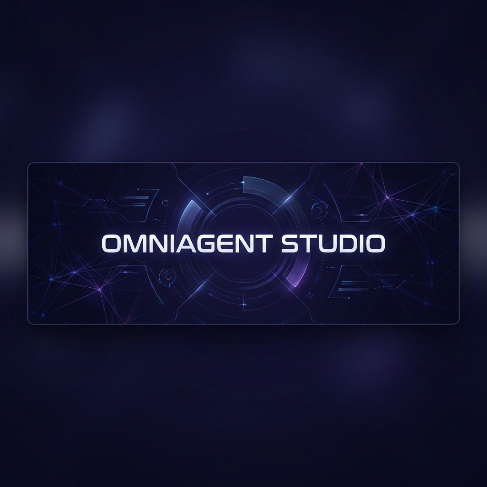
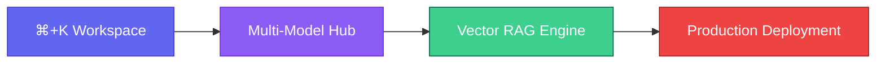
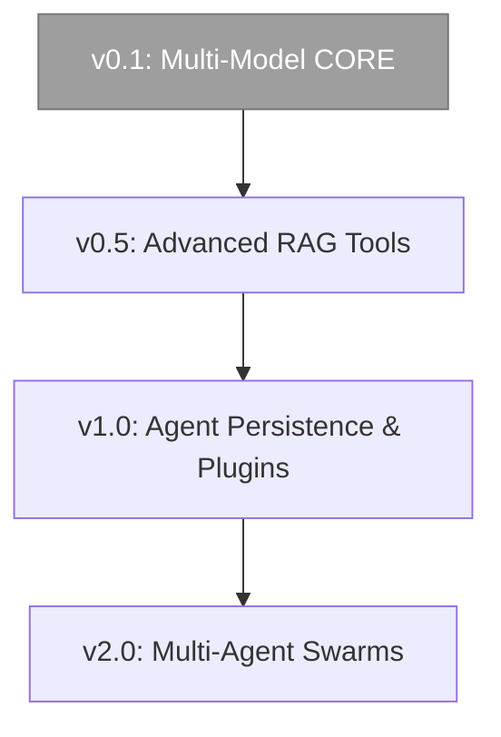

<p align="center">
  
</p>

<p align="center">
  <a href="README.md">English</a> |
  <a href="#-key-features">Features</a> |
  <a href="#-quick-links">Quick Links</a> |
  <a href="#-tech-stack">Tech Stack</a> |
  <a href="#-faq">FAQ</a>
</p>

<p align="center">
  
  
  
  
  
</p>

<p align="center">
  
  
  
</p>

<p align="center">
  
  
  
  
</p>

## Overview

**OmniAgent Studio** is a professional-grade workspace designed for developers to build, orchestrate, and deploy AI agents across the world's most powerful language models. By simplifying the transition from prompt to production, OmniAgent Studio provides a unified playground where you can test GPT-4o, Claude 3.5, and Gemini 1.5 Pro simultaneously, all while leveraging a high-performance RAG pipeline powered by Supabase Vector.

Visit [omniagent-studio.vercel.app](https://omniagent-studio.vercel.app) for a live demonstration.

## Who Is OmniAgent Studio For?

OmniAgent Studio is built for AI engineers and developers who need more than just a chat interface.

- **Developer Teams** building multi-agent systems for business logic.
- **AI Researchers** comparing model performance across different prompts.
- **Product Managers** prototyping RAG-based workflows without writing backend boilerplate.
- **Open-Source Enthusiasts** looking for a premium, self-hostable agent builder.

## How It Works



## Quick Links

- **[Live Demo](https://omniagent-studio.vercel.app)** - Experience the studio in real-time
- **[Documentation](#-overview)** - Full guides and tutorials
- **[Setup Guide](docs/setup.md)** - Detailed environment configuration
- **[Report Issues](https://github.com/bhaktofmahakal/OminiAgent-Studio/issues)** - Bug reports and requests

## Quick Start

### Prerequisites
- Node.js 18.x or 20.x
- A Supabase account (for Vector storage)
- Clerk account (for Auth)
- API Keys: OpenAI, Anthropic, or Google Gemini

### Installation
```bash
# Clone the repository
git clone https://github.com/bhaktofmahakal/OminiAgent-Studio.git
cd OminiAgent-Studio

# Install dependencies
npm install
```

### Environment Configuration
Create a `.env.local` file:
```env
NEXT_PUBLIC_CLERK_PUBLISHABLE_KEY=pk_test_...
CLERK_SECRET_KEY=sk_test_...

NEXT_PUBLIC_SUPABASE_URL=https://xxx.supabase.co
NEXT_PUBLIC_SUPABASE_ANON_KEY=eyJ...

GOOGLE_AI_API_KEY=AIza...
```

### Launch the Studio
```bash
npm run dev
```

## Features

- **Multi-Model Support** - Unified interface for GPT-4o, Claude 3.5, Gemini 1.5 Pro, and Groq.
- **Advanced RAG Pipeline** - Integrated semantic search via Supabase Vector and local embeddings.
- **Premium UX/UI** - Cursor-inspired command palette (`⌘+K`) and glassmorphic design.
- **Real-Time Observability** - Track token usage, latency, and model performance metrics live.
- **Enterprise Auth** - Secure user management with Clerk and DB-level Row-Level Security.

## The OmniAgent Advantage

| Feature | Generic Chatbots | OmniAgent Studio |
| :--- | :--- | :--- |
| **Model Choice** | Single Model Locked | Any Support LLM |
| **Data Context** | Limited / Manual | Integrated Vector RAG |
| **UI Experience** | Basic Input | Command-Palette Driven |
| **Observability** | None | Real-time Performance Metrics |
| **Deployment** | SaaS Only | Fully Self-Hostable |

## Roadmap



## FAQ

**Q: Does OmniAgent Studio require a specific database?**
A: Yes, it is optimized for Supabase with the `pgvector` extension enabled for RAG capabilities.

**Q: Can I use local models?**
A: Currently, we support cloud providers (OpenAI, Anthropic, Google, Groq). Local model integration (via Ollama) is on the roadmap.

**Q: Is it free to use?**
A: The software is open-source (MIT). You only pay for the API tokens consumed by your chosen AI models.

---

<p align="center">
  Made with ❤️ by the <b>OmniAgent Studio</b> Team
</p>
